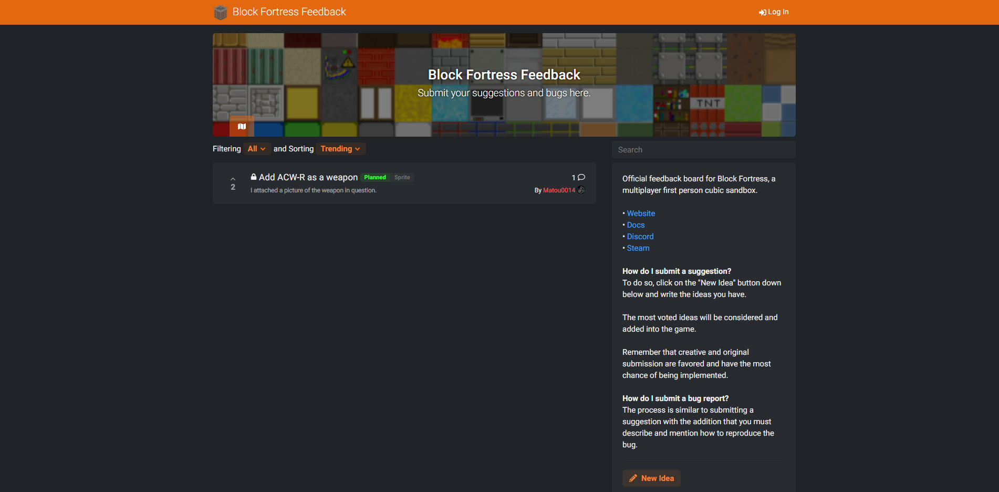

As a method to get feedback on the game, we are using [Feedbacky](https://feedbacky.net/) as an open-source service. We than transcribe everything back onto our Trello board for us to work on it. 

Click on the button below to access our board:

[Give your feedback](https://feedback.blockfortress.net/b/project){: .md-button }

### How do I submit a suggestion?
Simply click on the ":fontawesome-solid-pencil-alt: New Idea" button, a pop-up box will appear and you will be able to write down your suggestions or bugs. We will consider and implement to the game the most voted submissions after a while.

!!! tip
    Creative and original submissions are favored and have the most chance of being implemented.

### How do I submit a bug report?
The process is similar to submitting a suggestion with the addition that you must describe and mention how to reproduce the bug.

