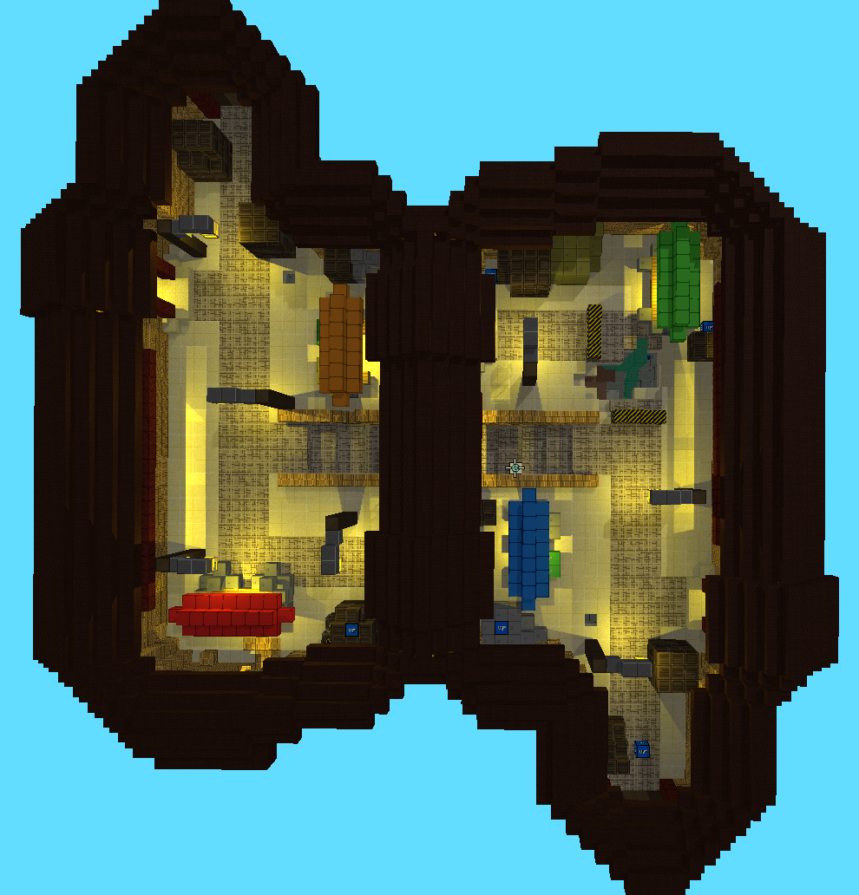
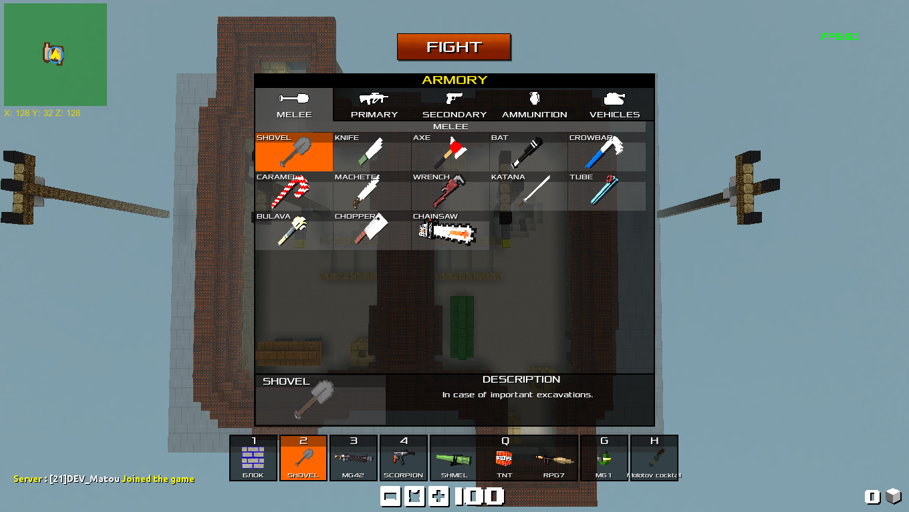

!!! info
	Curated maps will probably be moved into a dedicated wiki for the game in the near future.

## Description
{: height="400px" width="400px" align=right}
Set in a fictional Middle Eastern city, Asix is based on a food and goodies market with a distinctive middle overpass separating the map in two area. The map was created in December 2019 by the developer **Matou0014** and has since received a lot of details overhaul.

| **ASIX**      								|               |
|-----------------------------------------------|---------------|
| :fontawesome-solid-check: **Official**		| Not yet[^1]	|
| :fontawesome-solid-hashtag: **ID**			| 147 			|
| :fontawesome-solid-user: **Creator** 			| Matou0014 	|
| :fontawesome-solid-clock: **Created** 		| December 2019 |
| :fontawesome-solid-list-alt: **Gamemode**  	| Deathmatch 	|
| :fontawesome-solid-crop-alt: **Map Limits**	| Yes 			|

??? tip "Earlier Screenshot"
	{: height="600px" align=center}

## Name origin
The name "Asix" was chosen as a reference to the creator's favorite music band, Linkin Park with the name refering to an instrumental demo track called "A.06" part of the album [Underground 2.0](http://linkinpedia.com/index.php?title=A.06).

[^1]: The official status for curated map as not yet been planned due to currently existing BLOCKADE 3D maps, though we are planning to remove them later in the beta.	