Add description

## Commands

| Value | Description |
|--|--|
| togglewand | Command to toggle the wand. |
| wandreplace `block` | Replace the area that you selected with the shovel with a new block. |
| wanddelete | Delete the blocks in the area you selected with the shovel. |
| wandcopy | **Not yet available.** Copy the blocks you selected with the shovel. |
| wandpaste | **Not yet available.** Paste the blocks that you have copied with the shovel. |

## Blocks

| Block 							   | Name 				| Suggested 		| 
|--------------------------------------|--------------------|-------------------|
|   		   | Stoneend 			| metal1 			|
|  			   | Stone 				| metal2 			|
|  		   | R_b_blue 			| spawnbattle0 		|
|  		   | R_b_red 			| spawnbattle1 		|
|  		   | R_b_green 			| spawnbattle2 		|
|  		   | R_b_yellow 		| spawnbattle3 		|
|  		   | R_c_blue 			| spawnversus0 		|
|  		   | R_c_red 			| spawnversus1 		|
|  	   | ParkourBlock 		| spawnparkour 		|
|  			   | R_z 		   		| spawnzombie 		|
|  		   | TankSpawn 			| spawntank 		|
|  		   | R_center 			| mapcenter 		|
| 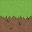 			   | Grass 				| grass 			|
| 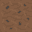 			   | Dirt 				| dirt 				|
| 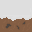 			   | Snow 				| snow 				|
| 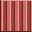 		   | Metall1 			| container1 		|
| 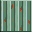 		   | Metall2 			| container2 		|
|  			   | !Water 			| cleanwater 		|
|  	   | !DirtyWater 		| dirtywater 		|
|  			   | !Lava 				| lava 				|
| 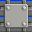   | ArmoredBrickBlue 	| armoredbrick0 	|
| 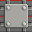    | ArmoredBrickRed 	| armoredbrick1 	|
| 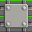  | ArmoredBrickGreen 	| armoredbrick2 	|
| 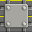 | ArmoredBrickYellow | armoredbrick3 	|
|  		   | Barrel2 			| metalbarrel0 		|		
| 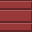 		   | Barrel1 			| metalbarrel1 		|
| 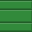 	       | Barrel3 			| metalbarrel2 		|
| 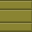 		   | Barrel4 			| metalbarrle3 		|
| 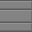 		   | Barrel5 			| metalbarrel4 		|
|  		   | Block14 			| tile0 			|
|  		   | Block16 			| tile1 			|
|  		   | Block15 			| tile2 			|	
| 		       | Block13 			| tile3 			|
|  	   | BlackWindow 		| tile4 			|
|  		   | Block11 			| tile5 			|
| 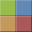 		   | Block12 			| tile6 			|
|  		       | Color2 			| color0 			|
|  			   | Color1 			| color1 			|
|  			   | Color3 			| color2 			|
|  			   | Color4 			| color3 			|
|  			   | Color5 			| color4 			|
|  			   | Color6 			| color5 			|
|  			   | Color7 			| color6 			|	
|  			   | Color8 			| color7 			|	
|  		   	   | Color9 			| color8 			|	
|  		   | Color10 			| color9 			|
|  		   | Color11 			| color10 			|
|  		   | Color12 			| color11			|
| 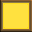 			   | Lamp 				| light 			|
| 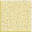 		       | Sand 				| sand 				|
| 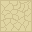 	   | HardenedSand 		| hardsand 			|
| 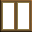 			   | Window 			| woodenwindow 		|
|  			   | Glass 				| metalwindow 		|
|  	   | WindowFrAME 		| woodenframe 		|
|          | GlassFrame 		| metalframe		|
|  			   | Box 	       		| lightbox 			|
| 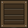 			   | Box2 				| darkbox 			|
| 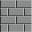 			   | Block3 			| brick0 			|
| 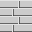 			   | Block6 			| brick1 			|
| 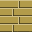 			   | Block7 			| brick2 			|
| 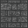 			   | Block8 			| brick3 			|
|  			   | Brick 				| brick4 			|
| 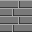 			   | Brick2 			| brick5 			|
|  			   | Stone7 			| stone0 			|
| 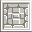 			   | Stone8 			| stone1 			|
| 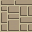 			   | Stone3 			| stone3 			|
| 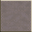 		       | Stone6 			| stone4 			|
| 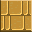 			   | Stone5 			| stone5 			|
|  			   | Block5 			| airduct 			|
| 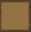 			   | Wood 				| lightwood 		|
| 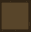 			   | Wood2 				| darkwood 			|
|  			   | Planks 			| planks 			|
|  			   | Block2 			| concrete0 		|
| 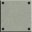 			   | Block4 			| concrete1 		|
| 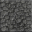 			   | Stone2 			| cobblestone 		|
|  	   | !CleanWater 		| diamon 			|
| 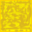 			   | Gold 				| gold 				|
| 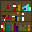 		   | Bookshelf 			| bookshelf 		|
| 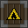 			   | Block9 			| flammablecrate 	|
|  			   | TNT 				| tnt 				|
| 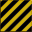 			   | Danger 			| warning 			|
| 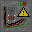 	   | ElectricBox 		| electricbox 		|
|  			   | Leaf 				| leaf 				|
| 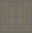 	   | AncientMarble 		| marbleancient 	|
| 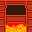 		   | PizzaOven 			| furnace 			|
| 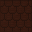 			   | Tile 				| rooftop 			|
| 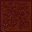 			   | Sand2 				| redsand			|	
| 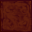 			   | Stone4 			| redstone0			|
| 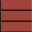 		   | Block10 			| redstone1 		|